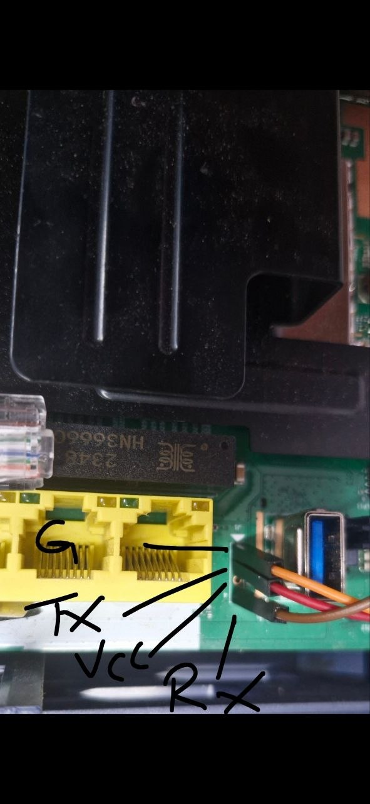

# JAF IDU UART Access

_Disclaimer: This is ONLY for educational purposes, No one is responsible for any type of damage. So be aware._

## Steps

1. Strip apart the IDU and find the 4 uart pins. Some models have pins already soldered, others are just unpopulated pads. **NOTE:** The pin layout is NOT standardized across all models. Verify your model in the "Hardware Specifics" section below before connecting.

2. Only connect Rx, Tx, and GND. Do not connect the VCC (3.3V) pin to your usb-to-ttl or serial converter device. Doing so may supply power to the board externally and fry your IDU.

3. Install Putty (or your preferred serial terminal), use the configurations below, and connect the IDU to your serial converter.

4. Power on the IDU and observe the text stream. If you see garbled text, check your connections, verify logic levels (most are 3.3V), or try reversing the Rx and Tx pins.

## Hardware Specifics

### JIDU6801 (and others with standard layout)
Most models follow a generic pattern (usually marked on the PCB):

*(Assuming standard layouts like GND-TX-RX-VCC)*

### JIDU6411 (IPQ95xx based)
This model has an unpopulated 4-pin header labeled **J1** located between the LAN ports and the USB port. **This layout is unconventional and dangerous if miswired.** VCC is located between TX and RX.

**Verified Pinout (Top to Bottom):**
1. **GND**
2. **TX** (Router output)
3. **VCC** (3.3V) - **CAUTION: DO NOT CONNECT**
4. **RX** (Router input)

**Important note on series resistors (JIDU6411):** If you use a series resistor to protect your adapter's RX pin during probing, it *must* be low impedance. Tests confirmed that high-value resistors (e.g., 10kΩ) will act as an RC filter at this baud rate, killing the high-speed signaling and preventing keystrokes from interrupting U-Boot. Use 1kΩ to 4.7kΩ max, or connect directly if your logic levels match.

## Terminal Configs 🐮

**BaudRate:** 115200  
**DataBits:** 8  
**StopBits:** 1  
**Parity:** None  
**FlowControl:** None

## General Troubleshooting

The standard 115200 baud has been verified on JIDU6801 and JIDU6411. If you encounter garbled text on other models, try other common baud rates (like 57600 or 9600). If issues persist, verify your USB-to-TTL converter is working correctly by doing a loopback test (connecting TX to RX on the converter itself).
